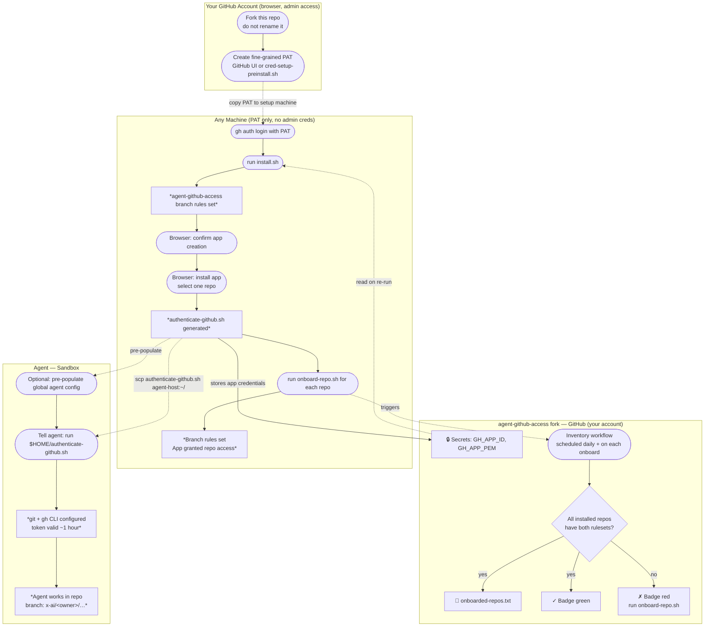

[](https://github.com/ardentperf/agent-github-access/actions/workflows/test.yml)
[](https://github.com/ardentperf/agent-github-access/actions/workflows/e2e.yml)
[](https://github.com/ardentperf/agent-github-access/actions/workflows/inventory.yml)

# Agent GitHub Access

> **Personal GitHub accounts only.** This project is designed for individual users on free GitHub accounts. It is not intended for GitHub Organizations or Enterprise accounts and has not been tested with them.

Give an AI agent a distinct GitHub identity with server-side guardrails: the agent can only push to branches it owns, can never touch your personal or main branches, and its activity is unambiguously attributed in every GitHub view.

## How it works

A dedicated **GitHub App** acts as the agent's identity. Repository rulesets enforce that the app can only create or modify branches matching `x-ai/<owner>/**`. Every commit the agent makes appears as `<username>-agent[bot]` in the GitHub UI. The `x-ai/` prefix sorts to the end of the branch list, keeping agent branches visually separate from human work.

You start by forking this repo into your personal account. Your `agent-github-access` fork becomes the home for this tool's state — specifically, the GitHub App credentials (app ID and private key) are stored as secrets in your `agent-github-access` fork. The setup scripts read and write these secrets so that `install.sh` and `onboard-repo.sh` are idempotent: re-running them is always safe and picks up where it left off.

`install.sh` generates a self-contained `authenticate-github.sh` with the app credentials embedded. Copy that single file to the agent's sandbox — it handles token generation, git configuration, and gh CLI authentication.

> **Warning:** By default, rulesets will also block any other GitHub Apps installed on the repo (e.g. CI bots, Dependabot) from pushing to non-agent branches. If another app stops being able to push after onboarding, go to **Settings → Rules → Rulesets → agent-gh-access-apps-blocked-from-non-ai-branches** and add it manually under **Bypass list**.



## Prerequisites

- A **personal** GitHub account (free tier is fine; not for orgs or enterprise)
- [`gh` CLI](https://cli.github.com/), `jq`, `python3`, `openssl` on the machine where you run the setup scripts

## Setup

The setup process has two distinct privilege levels. Steps 0–1 require your GitHub credentials (admin access). Steps 2–5 require only the fine-grained PAT you create in step 1 — no classic token or OAuth session needed.

**0. Fork this repo** *(GitHub UI, admin access)*

Fork `ardentperf/agent-github-access` into your personal GitHub account. Do not rename your fork of this repo — the repo name must stay `agent-github-access`.

**1. Create a fine-grained PAT** *(GitHub UI, admin access)*

In the GitHub UI, create a fine-grained PAT with these settings:
- **Repository access**: your `agent-github-access` fork (`<username>/agent-github-access`) only
- **Permissions**: Administration (read/write), Secrets (read/write)
- **Expiration**: 90 days recommended

`cred-setup-preinstall.sh` is provided as a reference and convenience — read it to understand exactly what is being requested, then run it on any machine where you are logged in to GitHub in a browser to get a pre-filled URL:

```bash
./cred-setup-preinstall.sh <github-username>
```

**2. Authenticate gh with the PAT** *(any machine, PAT only)*

On the machine where you will run the setup scripts:

```bash
echo '<your-pat>' | gh auth login --hostname github.com --with-token
```

**3. Create the GitHub App and generate scripts** *(any machine, PAT only)*

```bash
./install.sh
# If you have multiple gh accounts authenticated:
./install.sh <username>
```

If `GH_APP_ID` is already set as a secret in your `agent-github-access` fork, the script will detect this and exit early — the app already exists. See [Uninstalling / full cleanup](#uninstalling--full-cleanup) if you need to start over.

Two scripts are generated:
- `authenticate-github.sh` — give this to the agent
- `onboard-repo.sh` — run this per repo on the same machine

The app ID and private key are stored as secrets in your `agent-github-access` fork (`GH_APP_ID` and `GH_APP_PEM`) so you don't need to keep the generated scripts around to re-run setup.

**4. Install the app** *(browser)*

A browser tab opens automatically. On the GitHub page:
- Choose **Only select repositories**
- Select **one repo** you intend the agent to use (GitHub requires at least one)
- Click **Install**

The `agent-github-access` fork already has its branch protection rules in place (applied in step 3), so there is no window of unguarded access.

**5. Grant the agent access to a repository** *(any machine, PAT only)*

```bash
./onboard-repo.sh repo
# or for a repo outside your account:
./onboard-repo.sh owner/repo
```

For your own repos, pass just the repo name. For repos outside your account, the script forks the target repo into your account automatically then configures it. If you already have such a fork, pass it directly instead.

Re-running `onboard-repo.sh` for a repo is safe — it replaces any existing ruleset with the current configuration. This is the correct way to re-onboard after recreating the app.

Repeat for each repo the agent should work in.

**6. Give the agent its credentials**

Copy `authenticate-github.sh` to the agent's home directory:

```bash
scp authenticate-github.sh user@agent-host:~/
```

The agent must run `~/authenticate-github.sh` before doing any GitHub work, and re-run it whenever its token expires (~1 hour). Placing it in `$HOME` gives it a stable, predictable path that can be referenced in global memory instructions across all repos and sessions.

---

## Repo access controls

For each onboarded repo, `onboard-repo.sh` creates two GitHub rulesets:

| Ruleset | Covers | Effect |
|---|---|---|
| `agent-gh-access-apps-blocked-from-non-ai-branches` | all branches **except** `x-ai/<owner>/**` | Agent app cannot push outside its prefix |
| `agent-gh-access-apps-must-sign` | branches matching `x-ai/<owner>/**` | Every commit must be signed and verified by GitHub |

Human collaborators (write, maintain, admin roles) bypass both rulesets. The first ruleset excludes the agent prefix so it doesn't apply there; the second targets the agent prefix directly. Together they ensure the agent can only push to its own branches and every commit it makes is visibly attributed.

The signature requirement enforces bot identity without needing a separate email-pattern rule. GitHub's verification logic requires that the committer email in the commit matches a verified email on the account that owns the signing key. The bot's noreply address (`APP_ID+owner-agent[bot]@users.noreply.github.com`) is only associated with the GitHub App bot account — no human can register it — so a commit carrying that email can only pass verification if GitHub signed it on behalf of the app. `authenticate-github.sh` configures git to use this email, so agent commits are rendered as `<owner>-agent[bot]` with the app avatar in the GitHub UI.

## Agent branch naming

All agent branches must follow this pattern:

```
x-ai/<owner>/<description>
```

For example: `x-ai/ardentperf/fix-deploy-workflow`

GitHub enforces this server-side. Any push to a branch outside this pattern will be rejected.

## Revoking agent access

To immediately cut off all agents using this app, delete the app's private key:

**GitHub → Settings → Developer settings → GitHub Apps → your app → Edit → Private keys → Delete**

New token requests are blocked immediately — the agent can no longer refresh its credentials. Any token already in hand remains valid until it expires (~1 hour). To revoke active tokens instantly, uninstall or delete the app entirely.

## Uninstalling / full cleanup

1. **Delete the GitHub App** — Settings → Developer settings → GitHub Apps → your app → Edit → Advanced → Delete GitHub App. This immediately revokes all tokens and removes the app from every installed repo.
2. **Run `uninstall.sh`** — deletes the fork secrets and removes the two `agent-gh-access-*` rulesets from every repo in the inventory:

```bash
./uninstall.sh
```

The script reads the app ID from `onboarded-repos.txt` (committed to the fork by the inventory workflow) and will prompt you to delete the app if it detects it still exists before proceeding.

To reinstall from scratch after a full cleanup, re-run `install.sh` and `onboard-repo.sh` as in the original setup.

## Credential refresh

The agent's token expires after ~1 hour. The agent must re-run `authenticate-github.sh` whenever it sees any of:

- HTTP 401 or `Bad credentials` from api.github.com
- `gh: To use GitHub CLI, please run: gh auth login`

---

## Global agent instructions

The branch naming rule and credential refresh procedure apply across **all** repositories, so they belong in your agent's **global** memory — not in any repo-local file. A repo-local file would only be loaded when the agent is working in that specific repo; these rules need to be active everywhere.

### Suggested global AGENTS.md content

When the agent runs `~/authenticate-github.sh` it prints exactly what to store, with your GitHub username filled in. You can also pre-populate the global file manually so the rules are in place from the first session. Either way, the content looks like this — **replace `<your-github-username>` with your actual GitHub username before saving**:

```
BRANCH PREFIX: x-ai/<your-github-username>/
  e.g. x-ai/<your-github-username>/fix-deploy-workflow
  GitHub enforces this server-side. Never push to main or any other prefix.

COMMIT METHOD: gh api repos/<your-github-username>/{repo}/git/... (GitHub Git Data API)
  Do NOT use git commit + git push. Agent branches require signed commits;
  only API-created commits are signed automatically.

RE-RUN ~/authenticate-github.sh before retrying if you see:
  HTTP 401 or "Bad credentials" from api.github.com
  gh: To use GitHub CLI, please run: gh auth login
```

### Global instruction file paths by tool

| Tool | Global instructions file | Notes |
|---|---|---|
| **Claude Code** | `~/.claude/CLAUDE.md` | Also auto-saves runtime memory to `~/.claude/projects/*/memory/MEMORY.md` |
| **GitHub Copilot** | JetBrains: `~/.config/github-copilot/intellij/global-copilot-instructions.md` | VS Code has no canonical global file; use user-scoped settings |
| **Cursor** | Settings → General → **Rules for AI** | Stored in Cursor's internal database, not a plain file |
| **Windsurf** | `~/.codeium/windsurf/memories/global_rules.md` | Cascade also generates workspace memories automatically |
| **Aider** | `~/.aider.conf.yml` with `read: /absolute/path/to/global-conventions.md` | File path must be absolute in the home config |
| **Devin** | Settings & Library → Knowledge → **Add Knowledge** → pin to *All repositories* | UI-based, not a file |
| **OpenClaw** | `~/.openclaw/MEMORY.md` | Project-level `MEMORY.md` files are also loaded; global file applies across all projects |

> **Note on repo-local AGENTS.md:** Devin and some other tools also recognise an `AGENTS.md` at the repository root. A repo-level file is appropriate for repo-specific context (architecture notes, test commands), but the GitHub access rules above should only live in the global location — not in individual repos — so they are always active regardless of which repo the agent is working in.
