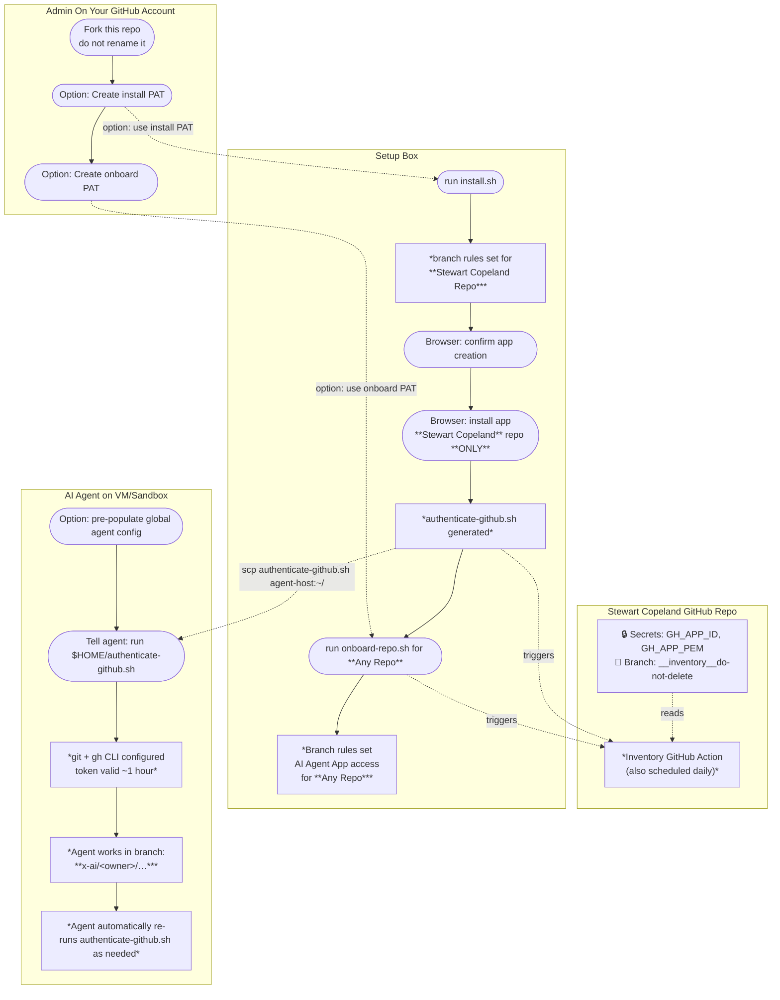

[](https://github.com/ardentperf/stewart-copeland-ai-police/actions/workflows/test.yml)
[](https://github.com/ardentperf/stewart-copeland-ai-police/actions/workflows/e2e.yml)
[](https://github.com/ardentperf/stewart-copeland-ai-police/actions/workflows/inventory.yml)

📋 [Onboarded repositories inventory](https://github.com/ardentperf/stewart-copeland-ai-police/tree/x-ai/ardentperf/__inventory__do-not-delete)

---


**Does your young AI like to rock-and-roll in YOLO mode on a VM while chatting you up remotely on your phone? Want to collaborate more, but feeling nervous about handing over creds to your personal GitHub repo?**

**Stewart Copeland will Police your child prodigy with clear identity, unambiguous attribution, minimum fine-grained privileges, and branch rules. Rest at ease: GitHub server-side enforcement ensures that your up-and-coming rock star can never touch your main branches or personal work, and nothing happens outside their own branches until you approve and merge their PR.**

> **Personal GitHub accounts only.** This project is designed for individual users on free GitHub accounts.

[](https://flickr.com/photos/74085116@N00/2743273551/in/photostream/)

*[Stewart Copeland at Madison Square Garden, Aug 7 2008, Nikon Coolpix S550](https://flickr.com/photos/74085116@N00/2743273551/in/photostream/) by [Nicole Pellegrini](https://www.flickr.com/people/74085116@N00/), [CC BY-ND 2.0](https://creativecommons.org/licenses/by-nd/2.0/)*

This code is maintained by a real human named [Jeremy Schneider](https://ardentperf.com), who does a lot of work with Postgres *(like writing CloudNativePG Lab Exercises and co-organizing [the in-person Seattle Postgres User Group meetups](https://youtube.com/@seattle-postgres))* and who prefers to `--dangerously-skip-permissions` as much as possible.

---

- [How it works](#how-it-works)
- [Repo access controls](#repo-access-controls)
- [App permissions](#app-permissions)
- [Personal Access Tokens](#personal-access-tokens)
- [Architecture](#architecture)
- [Prerequisites](#prerequisites)
- [Setup](#setup)
- [Uninstalling / full cleanup](#uninstalling--full-cleanup)
- [Credential refresh](#credential-refresh)
- [Global agent instructions](#global-agent-instructions)

## How it works

A dedicated **GitHub App** acts as the agent's identity. Repository rulesets enforce that the app can only create or modify branches matching `x-ai/<owner>/**`. Every commit the agent makes appears as `<owner>-agent[bot]` in the GitHub UI. The `x-ai/` prefix sorts to the end of the branch list, keeping agent branches visually separate from human work.

You start by forking this repo into your personal account. Your `stewart-copeland-ai-police` fork becomes the home for this tool's state — specifically, the GitHub App credentials (app ID and private key) are stored as secrets in your `stewart-copeland-ai-police` fork.

`install.sh` generates a self-contained `authenticate-github.sh` with the app credentials embedded. Copy that single file to the agent's sandbox — it handles token generation, git configuration, and gh CLI authentication.

> **Warning:** By default, rulesets will also block any other GitHub Apps installed on the repo (e.g. CI bots, Dependabot) from pushing to non-agent branches. If another app stops being able to push after onboarding, go to **Settings → Rules → Rulesets → agent-gh-access-apps-blocked-from-non-ai-branches** and add it manually under **Bypass list**.

## Repo access controls

All agent branches must follow this pattern:

```
x-ai/<owner>/<description>
```

For example: `x-ai/ardentperf/fix-deploy-workflow`

GitHub enforces this server-side. Any push to a branch outside this pattern will be rejected.

For each onboarded repo, `onboard-repo.sh` creates one or two GitHub rulesets (the second requires verified commits, which is enabled by default at install time):

| Ruleset | Covers | Effect |
|---|---|---|
| `agent-gh-access-apps-blocked-from-non-ai-branches` | all branches **except** `x-ai/<owner>/**` | Agent app cannot push outside its prefix |
| `agent-gh-access-apps-must-sign` | branches matching `x-ai/<owner>/**` | Every commit must be signed and verified by GitHub |

Human collaborators (write, maintain, admin roles) bypass both rulesets. The first ruleset excludes the agent prefix so it doesn't apply there; the second targets the agent prefix directly. Together they ensure the agent can only push to its own branches and every commit it makes is visibly attributed.

The signature requirement enforces bot identity without needing a separate email-pattern rule. GitHub's verification logic requires that the committer email in the commit matches a verified email on the account that owns the signing key. The bot's noreply address (`APP_ID+owner-agent[bot]@users.noreply.github.com`) is only associated with the GitHub App bot account — no human can register it — so a commit carrying that email can only pass verification if GitHub signed it on behalf of the app. `authenticate-github.sh` configures git to use this email, so agent commits are rendered as `<owner>-agent[bot]` with the app avatar in the GitHub UI.

## App permissions

The GitHub App is granted the following permissions on each installed repo:

| Permission | Level | Why |
|---|---|---|
| Contents | read/write | push commits, create/delete branches |
| Pull requests | read/write | open, update, and merge PRs |
| Workflows | read/write | modify `.github/workflows/` files |
| Actions | read or **read/write** *(user choice at install)* | trigger, cancel, and re-run workflow runs |
| Checks | read | read check run and check suite results |
| Metadata | read | required by all GitHub Apps |

> **Warning — `actions: write` scope:** Because the agent also has `workflows: write`, it could write a workflow and then trigger it. Branch protection still applies to the triggered workflow, but it runs with `GITHUB_TOKEN` and can read all Actions secrets in the repo (deploy keys, cloud credentials, etc.). Only enable this if your repos have no sensitive Actions secrets. `install.sh` will ask you to make an explicit choice at setup time.

## Personal Access Tokens (PATs)

Optionally, Stewart Copeland itself can run with minimum privileges using two separate fine-grained PATs with minimal, non-overlapping scopes:

| PAT | Used by | Repository access | Permissions | Lifetime |
|---|---|---|---|---|
| **Install PAT** | `install.sh`, `uninstall.sh` | `stewart-copeland-ai-police` fork only | Administration, Secrets, Contents | One-time; can expire/be deleted after install |
| **Onboard PAT** | `onboard-repo.sh` | All repositories | Administration only | Keep active while onboarding repos |

## Architecture



## Prerequisites

- A **personal** GitHub account (free tier is fine; not for orgs or enterprise)
- [`gh` CLI](https://cli.github.com/), `jq`, `python3`, `openssl` on the machine where you run the setup scripts
- Python `PyNaCl` package: `pip install PyNaCl` (used by `install.sh` to encrypt secrets)

## Setup

**1. Fork this repo** *(GitHub UI, admin access)*

Fork `ardentperf/stewart-copeland-ai-police` into your personal GitHub account. Do not rename your fork of this repo — the repo name must stay `stewart-copeland-ai-police`.

**2a. Create the install PAT** *(optional — GitHub UI, admin access)*

Skip this step if you're comfortable running `install.sh` with your existing GitHub credentials. If you'd prefer minimum privileges, create a fine-grained PAT with these settings:
- **Repository access**: your `stewart-copeland-ai-police` fork (`<owner>/stewart-copeland-ai-police`) **only**
- **Permissions**: Administration (read/write), Secrets (read/write), Contents (read/write)
- **Expiration**: can be short (e.g. 7 days) — only needed for install and uninstall

`cred-setup-preinstall.sh` is provided as a reference and convenience — run it on any machine where you are logged in to GitHub in a browser to get a pre-filled URL:

```bash
./cred-setup-preinstall.sh <github-username> install
```

**2b. Create the onboard PAT** *(optional — GitHub UI, admin access)*

Skip this step if you're comfortable running `onboard-repo.sh` with your existing GitHub credentials. If you'd prefer minimum privileges, create a fine-grained PAT with these settings:
- **Repository access**: **All repositories** (needed to create rulesets on repos you onboard)
- **Permissions**: Administration (read/write) **only** — no Secrets, no Contents
- **Expiration**: 90 days recommended; renew as needed

```bash
./cred-setup-preinstall.sh <github-username> onboard
```

**3. Create the GitHub App and generate scripts** *(any machine)*

```bash
# With install PAT from step 2a:
GH_TOKEN='<your-install-pat>' ./install.sh
# Without PAT (using existing credentials):
./install.sh
```

If `GH_APP_ID` is already set as a secret in your `stewart-copeland-ai-police` fork, the script will detect this and exit early — the app already exists. See [Uninstalling / full cleanup](#uninstalling--full-cleanup) if you need to start over.

One script is generated:
- `authenticate-github.sh` — give this to the agent

The app ID and private key are stored as secrets in your `stewart-copeland-ai-police` fork (`GH_APP_ID` and `GH_APP_PEM`). The inventory branch is also initialized at this step.

**4. Install the app** *(browser)*

A browser tab opens automatically. On the GitHub page:
- Choose **Only select repositories**
- Select **only your `stewart-copeland-ai-police` fork** — it already has branch protection in place
- Click **Install**

> **Warning:** Do not select any other repos here. Other repos must be added later using `./onboard-repo.sh` to set up branch protection first.

**5. Grant the agent access to a repository** *(any machine)*

```bash
# With onboard PAT from step 2b:
GH_TOKEN='<your-onboard-pat>' ./onboard-repo.sh repo
# Without PAT (using existing credentials):
./onboard-repo.sh repo
```

Re-running `onboard-repo.sh` for a repo is safe — it replaces any existing ruleset with the current configuration. This is the correct way to re-onboard after recreating the app.

Repeat for each repo the agent should work in.

**6. Give the agent its credentials**

Copy `authenticate-github.sh` to the agent's home directory:

```bash
scp authenticate-github.sh user@agent-host:~/
```

The agent must run `~/authenticate-github.sh` before doing any GitHub work, and re-run it whenever its token expires (~1 hour). Placing it in `$HOME` gives it a stable, predictable path that can be referenced in global memory instructions across all repos and sessions.

## Uninstalling / full cleanup

1. **Run `uninstall.sh`** with the **install PAT** — fetches the inventory, prompts you to delete the GitHub App if it still exists, deletes the fork secrets, and generates `uninstall-rulesets.sh`:

```bash
GH_TOKEN='<your-install-pat>' ./uninstall.sh
```

The script will detect if the app still exists and prompt you with the deletion URL before proceeding. Once the app is deleted, all tokens are immediately revoked and the app is removed from every installed repo.

2. **Run `uninstall-rulesets.sh`** with the **onboard PAT** — removes the two `agent-gh-access-*` rulesets from every repo in the inventory:

```bash
GH_TOKEN='<your-onboard-pat>' ./uninstall-rulesets.sh
```

`uninstall-rulesets.sh` is generated dynamically by `uninstall.sh` with the repo list embedded. It is not checked into the repository.

To reinstall from scratch after a full cleanup, re-run `install.sh` and `onboard-repo.sh` as in the original setup.

## Credential refresh

The agent's token expires after ~1 hour. The agent must re-run `authenticate-github.sh` whenever it sees any of:

- HTTP 401 or `Bad credentials` from api.github.com
- `gh: To use GitHub CLI, please run: gh auth login`

Each run of `~/authenticate-github.sh` prints instructions for the agent to store in its [global memory](#global-agent-instructions). When verified commits are required (the default), the output includes:

```
GitHub credentials configured. Token expires in ~1 hour.

STORE IN GLOBAL MEMORY (not repo-local — applies across all repos):

BRANCH PREFIX: x-ai/<your-github-username>/
  e.g. x-ai/<your-github-username>/fix-deploy-workflow
  GitHub rejects pushes to any other prefix. Never push to main.

COMMIT METHOD: gh api repos/<your-github-username>/{repo}/git/... (GitHub Git Data API)
  Do NOT use git commit + git push. Agent branches require signed commits;
  only API-created commits are signed automatically.

RE-RUN ~/authenticate-github.sh before retrying if you see:
  remote: Invalid username or password.
  fatal: Authentication failed for 'https://github.com/'
  HTTP 401 or "Bad credentials" from api.github.com
  gh: To use GitHub CLI, please run: gh auth login

STORE THE ABOVE IN GLOBAL MEMORY (not repo-local).
```

---

## Global agent instructions

The branch naming rule and credential refresh procedure apply across **all** repositories, so they belong in your agent's **global** memory — not in any repo-local file. A repo-local file would only be loaded when the agent is working in that specific repo; these rules need to be active everywhere.

You can pre-populate the global file before the first session: run `~/authenticate-github.sh` and copy the output it prints into the appropriate file for your tool.

### Global instruction file paths by tool

> **Disclaimer:** Only the Claude Code entry below has been directly verified. All other entries are based on AI research and may be outdated or incorrect. PRs welcome from anyone who has verified how a tool works firsthand.

| Tool | Global instructions file | Notes |
|---|---|---|
| **Claude Code** | `~/.claude/CLAUDE.md` | Also auto-saves runtime memory to `~/.claude/projects/*/memory/MEMORY.md` |
| **VS Code GitHub Copilot** | Settings → `github.copilot.chat.codeGeneration.instructions` | JSON array in `settings.json`; no canonical global markdown file |
| **Cursor** | Settings → General → **Rules for AI** | Stored in Cursor's internal database, not a plain file |
| **Windsurf** | `~/.codeium/windsurf/memories/global_rules.md` | Cascade also generates workspace memories automatically |
| **Aider** | `~/.aider.conf.yml` with `read: /absolute/path/to/global-conventions.md` | File path must be absolute in the home config |
| **Devin** | Settings & Library → Knowledge → **Add Knowledge** → pin to *All repositories* | UI-based, not a file |
| **OpenClaw** | `~/.openclaw/MEMORY.md` | Project-level `MEMORY.md` files are also loaded; global file applies across all projects |

> **Note on repo-local AGENTS.md:** Devin and some other tools also recognise an `AGENTS.md` at the repository root. A repo-level file is appropriate for repo-specific context (architecture notes, test commands), but the GitHub access rules above should only live in the global location — not in individual repos — so they are always active regardless of which repo the agent is working in.
