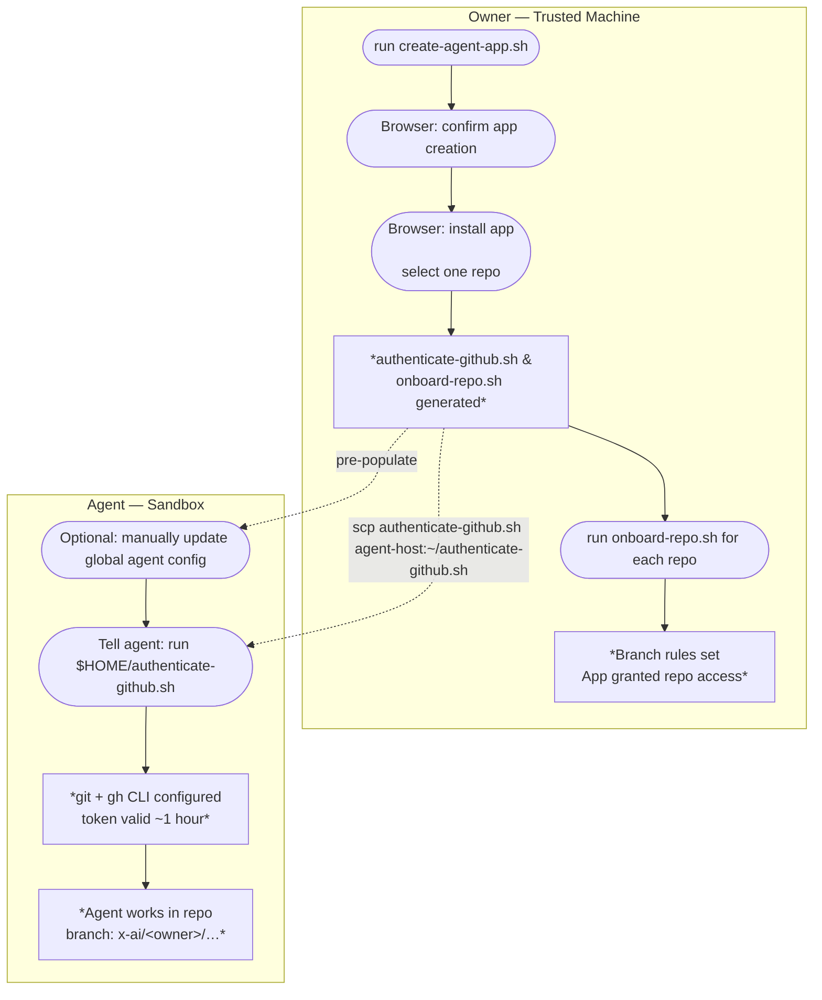

[](https://github.com/ardentperf/agent-github-access/actions/workflows/test.yml)

# Agent GitHub Access

Give an AI agent a distinct GitHub identity with server-side guardrails: the agent can only push to branches it owns, can never touch your personal or main branches, and its activity is unambiguously attributed in every GitHub view.

## How it works

A dedicated **GitHub App** acts as the agent's identity. Repository rulesets enforce that the app can only create or modify branches matching `x-ai/<owner>/**`. Every commit the agent makes appears as `<username>-agent[bot]` in the GitHub UI. The `x-ai/` prefix sorts to the end of the branch list, keeping agent branches visually separate from human work.

`create-agent-app.sh` generates a self-contained `authenticate-github.sh` with the app credentials embedded. Copy that single file to the agent's sandbox — it handles token generation, git configuration, and gh CLI authentication.

> **Warning:** By default, rulesets will also block any other GitHub Apps installed on the repo (e.g. CI bots, Dependabot) from pushing to non-agent branches. If another app stops being able to push after onboarding, go to **Settings → Rules → Rulesets → agent-gh-access-apps-blocked-from-non-ai-branches** and add it manually under **Bypass list**.



## Prerequisites

- [`gh` CLI](https://cli.github.com/) installed and authenticated
- `jq`, `python3`, `openssl` available on `$PATH`

## Setup (trusted machine, once)

**1. Create the GitHub App and generate scripts**

```bash
./create-agent-app.sh
# If you have multiple gh accounts authenticated:
./create-agent-app.sh <username>
```

Two scripts are generated:
- `authenticate-github.sh` — give this to the agent
- `onboard-repo.sh` — run this per repo on your trusted machine

**2. Install the app**

A browser tab opens automatically. On the GitHub page:
- Choose **Only select repositories**
- Select **one repo** you intend the agent to use (GitHub requires at least one)
- Click **Install**

Then immediately run step 3 for that repo. `onboard-repo.sh` sets up branch rules and closes the brief window where the app has unguarded access. On every subsequent run it also audits the installation and removes any repos that are missing the expected rules.

**3. Grant the agent access to a repository**

```bash
./onboard-repo.sh repo
# or for a repo outside your account:
./onboard-repo.sh owner/repo
```

For your own repos, pass just the repo name. For repos outside your account, the script forks it automatically then configures the fork. If you already have a fork, pass the fork directly instead.

Re-running `onboard-repo.sh` for a repo is safe — it replaces any existing ruleset with the current configuration. This is the correct way to re-onboard after recreating the app.

Repeat for each repo the agent should work in.

**4. Give the agent its credentials**

Copy `authenticate-github.sh` to the agent's home directory:

```bash
scp authenticate-github.sh user@agent-host:~/
```

The agent must run `~/authenticate-github.sh` before doing any GitHub work, and re-run it whenever its token expires (~1 hour). Placing it in `$HOME` gives it a stable, predictable path that can be referenced in global memory instructions across all repos and sessions.

---

## Repo access controls

For each onboarded repo, `onboard-repo.sh` creates two GitHub rulesets:

| Ruleset | Covers | Effect |
|---|---|---|
| `agent-gh-access-apps-blocked-from-non-ai-branches` | all branches **except** `x-ai/<owner>/**` | Agent app cannot push outside its prefix |
| `agent-gh-access-apps-must-sign` | branches matching `x-ai/<owner>/**` | Every commit must be signed and verified by GitHub |

Human collaborators (write, maintain, admin roles) bypass both rulesets. The first ruleset excludes the agent prefix so it doesn't apply there; the second targets the agent prefix directly. Together they ensure the agent can only push to its own branches and every commit it makes is visibly attributed.

The signature requirement enforces bot identity without needing a separate email-pattern rule. GitHub's verification logic requires that the committer email in the commit matches a verified email on the account that owns the signing key. The bot's noreply address (`APP_ID+owner-agent[bot]@users.noreply.github.com`) is only associated with the GitHub App bot account — no human can register it — so a commit carrying that email can only pass verification if GitHub signed it on behalf of the app. `authenticate-github.sh` configures git to use this email, so agent commits are rendered as `<owner>-agent[bot]` with the app avatar in the GitHub UI.

## Agent branch naming

All agent branches must follow this pattern:

```
x-ai/<owner>/<description>
```

For example: `x-ai/ardentperf/fix-deploy-workflow`

GitHub enforces this server-side. Any push to a branch outside this pattern will be rejected.

## Revoking agent access

To immediately cut off all agents using this app, delete the app's private key:

**GitHub → Settings → Developer settings → GitHub Apps → your app → Edit → Private keys → Delete**

New token requests are blocked immediately — the agent can no longer refresh its credentials. Any token already in hand remains valid until it expires (~1 hour). To revoke active tokens instantly, uninstall or delete the app entirely.

## Recreating the app

Delete the old app first (**Settings → Developer settings → GitHub Apps → your app → Edit → Advanced → Delete GitHub App**), then re-run `create-agent-app.sh`. After that, re-run `onboard-repo.sh` for each repo — it replaces the stale rulesets from the previous app with fresh ones tied to the new app's identity.

## Credential refresh

The agent's token expires after ~1 hour. The agent must re-run `authenticate-github.sh` whenever it sees any of:

- `remote: Invalid username or password.`
- `fatal: Authentication failed for 'https://github.com/'`
- HTTP 401 or `Bad credentials` from api.github.com
- `gh: To use GitHub CLI, please run: gh auth login`

---

## Global agent instructions

The branch naming rule and credential refresh procedure apply across **all** repositories, so they belong in your agent's **global** memory — not in any repo-local file. A repo-local file would only be loaded when the agent is working in that specific repo; these rules need to be active everywhere.

### Suggested global AGENTS.md content

When the agent runs `~/authenticate-github.sh` it prints exactly what to store. You can also pre-populate the global file manually so the rules are in place from the first session. Either way, the content looks like this — **replace `<your-github-username>` with your actual GitHub username before saving**:

```
BRANCH PREFIX: x-ai/<your-github-username>/
  e.g. x-ai/<your-github-username>/fix-deploy-workflow
  GitHub rejects pushes to any other prefix. Never push to main.

RE-RUN ~/authenticate-github.sh before retrying if you see:
  remote: Invalid username or password.
  fatal: Authentication failed for 'https://github.com/'
  HTTP 401 or "Bad credentials" from api.github.com
  gh: To use GitHub CLI, please run: gh auth login
```

### Global instruction file paths by tool

| Tool | Global instructions file | Notes |
|---|---|---|
| **Claude Code** | `~/.claude/CLAUDE.md` | Also auto-saves runtime memory to `~/.claude/projects/*/memory/MEMORY.md` |
| **GitHub Copilot** | JetBrains: `~/.config/github-copilot/intellij/global-copilot-instructions.md` | VS Code has no canonical global file; use user-scoped settings |
| **Cursor** | Settings → General → **Rules for AI** | Stored in Cursor's internal database, not a plain file |
| **Windsurf** | `~/.codeium/windsurf/memories/global_rules.md` | Cascade also generates workspace memories automatically |
| **Aider** | `~/.aider.conf.yml` with `read: /absolute/path/to/global-conventions.md` | File path must be absolute in the home config |
| **Devin** | Settings & Library → Knowledge → **Add Knowledge** → pin to *All repositories* | UI-based, not a file |
| **OpenClaw** | `~/.openclaw/MEMORY.md` | Project-level `MEMORY.md` files are also loaded; global file applies across all projects |

> **Note on repo-local AGENTS.md:** Devin and some other tools also recognise an `AGENTS.md` at the repository root. A repo-level file is appropriate for repo-specific context (architecture notes, test commands), but the GitHub access rules above should only live in the global location — not in individual repos — so they are always active regardless of which repo the agent is working in.
